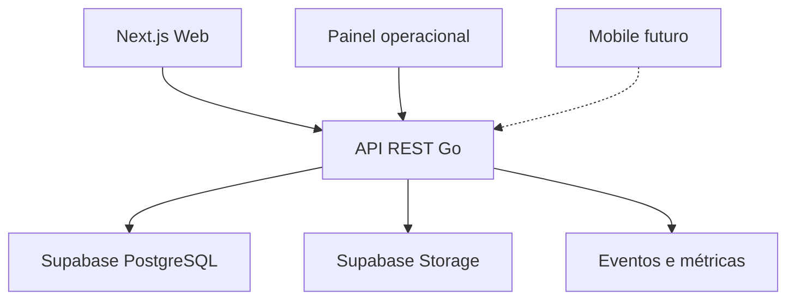

# Arquitetura do MVP

## Stack oficial

| Camada | Tecnologia | Responsabilidade |
| --- | --- | --- |
| Web | Next.js 16, React 19, TypeScript | SSR/SSG, SEO, interface e BFF restrito |
| Estilos | Sass Modules + BEM | Componentização, tokens e estilos encapsulados |
| API | Go, REST | Regras de negócio, autorização e integrações |
| Dados | Supabase PostgreSQL | Persistência relacional |
| Arquivos | Supabase Storage | Imagens e documentos moderados |
| Deploy | Vercel + serviço Go | Web e API com pipelines independentes |

## Topologia



O frontend não acessa tabelas de domínio diretamente. O Go é a fronteira de regras e segurança. Next.js pode executar leitura pública cacheável através da API, mas não duplica regra comercial.

## Estrutura-alvo

```text
apps/
  web/                 # Next.js
    app/
    components/
    features/
    styles/
services/
  api/                 # Go modular monolith
    cmd/api/
    internal/
      auth/
      catalog/
      journeys/
      leads/
      partners/
      moderation/
      reviews/
      analytics/
    migrations/
docs/product/
```

Não criar microsserviços. Web e API são dois deployables dentro do mesmo produto; o domínio do backend continua um monólito modular.

## Modelo de domínio

| Entidade | Papel |
| --- | --- |
| `businesses` | hospedagens, alimentação, comércio e serviços |
| `places` | praias, trilhas, patrimônio e pontos territoriais |
| `experiences` | atividades oferecidas por parceiros |
| `events` | agenda com data e capacidade indicativa |
| `packages` | ofertas prontas operadas pela agência |
| `journeys` | Meu Caminho montado pelo visitante |
| `journey_items` | seleções ordenadas dentro do caminho |
| `leads` | solicitação que transforma caminho em atendimento |
| `partner_accounts` | identidade de quem administra parceiros |
| `partner_applications` | entrada e validação de parceiro |
| `content_revisions` | alterações aguardando moderação |
| `reviews` | avaliações públicas moderáveis |
| `seal_assessments` | avaliação técnica separada de promoção |
| `consents` | prova de consentimentos relevantes |
| `analytics_events` | eventos pseudonimizados e minimizados |

## Contratos REST iniciais

```http
GET    /v1/catalog/search
GET    /v1/places/:slug
GET    /v1/businesses/:slug
GET    /v1/experiences/:slug
GET    /v1/events
GET    /v1/packages/:slug
GET    /v1/map/items

POST   /v1/journeys
GET    /v1/journeys/:token
POST   /v1/journeys/:token/items
PATCH  /v1/journeys/:token/items/:itemId
DELETE /v1/journeys/:token/items/:itemId
POST   /v1/leads

POST   /v1/partners/applications
POST   /v1/auth/magic-link
POST   /v1/auth/magic-link/verify
GET    /v1/partner/businesses
POST   /v1/partner/revisions

GET    /v1/admin/moderation
PATCH  /v1/admin/moderation/:id
GET    /v1/admin/leads
PATCH  /v1/admin/leads/:id
```

## Decisões arquiteturais

- cookie guarda apenas identificador opaco de jornada ou sessão; não é autenticação por si só;
- magic link cria sessão `HttpOnly`, `Secure`, `SameSite=Lax`, com expiração e rotação;
- traduções editoriais são persistidas por locale e possuem fallback explícito;
- mapa recebe apenas dados publicados e coordenadas permitidas;
- recomendações do MVP usam regras explicáveis, não perfilamento opaco;
- cache público deve ser invalidado após publicação moderada;
- logs usam `request_id` e jamais carregam telefone, e-mail ou texto livre completo.

## Definition of Done técnica

- critérios de aceitação demonstrados;
- testes unitários e de integração proporcionais ao risco;
- lint, typecheck e build aprovados;
- autorização testada no servidor;
- acessibilidade básica e responsividade verificadas;
- contratos e migrations versionados;
- observabilidade e rollback conhecidos.
