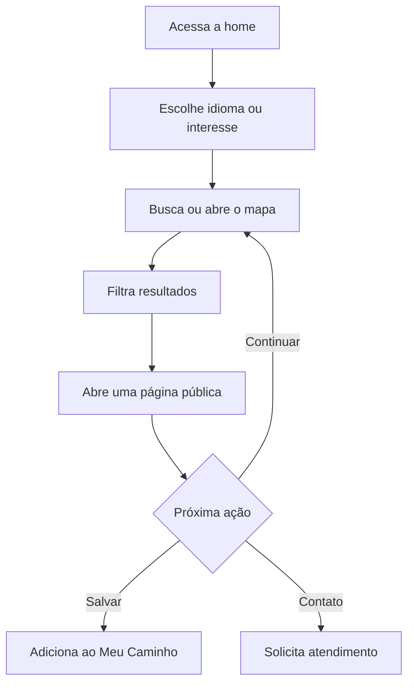
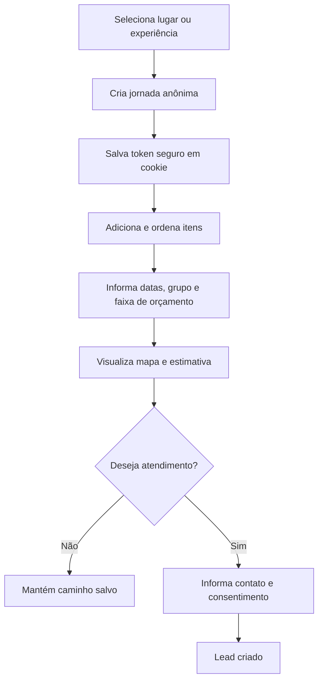
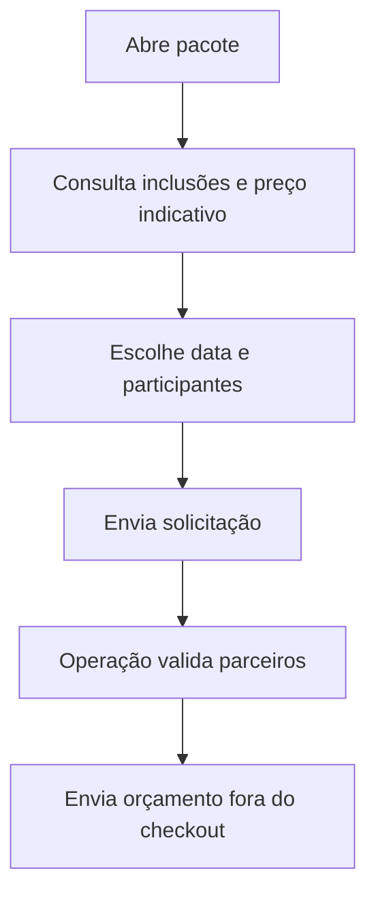
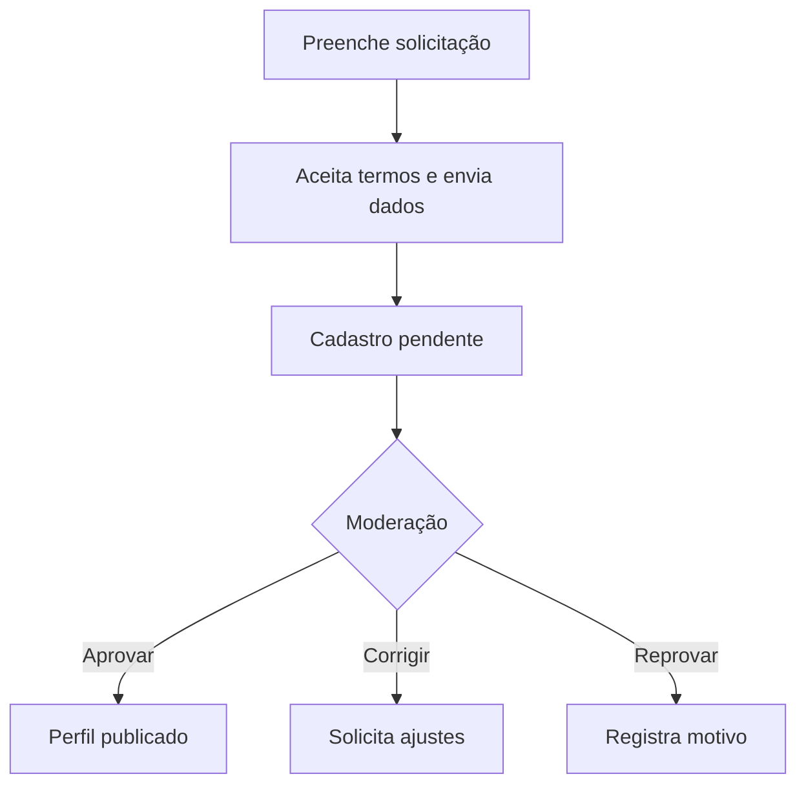
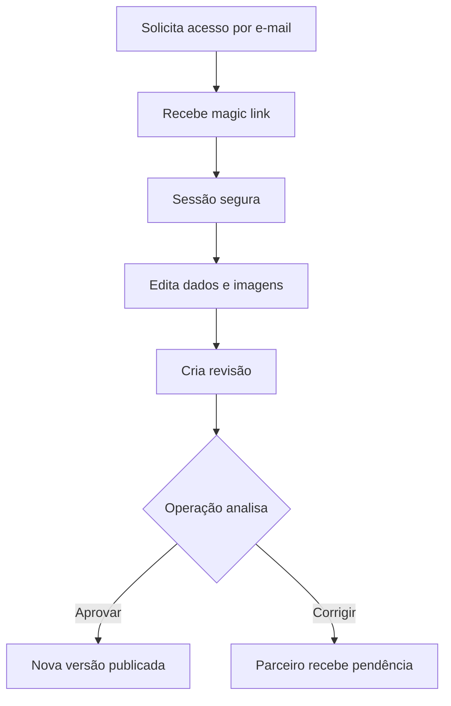
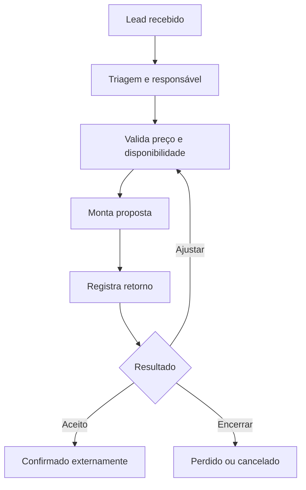
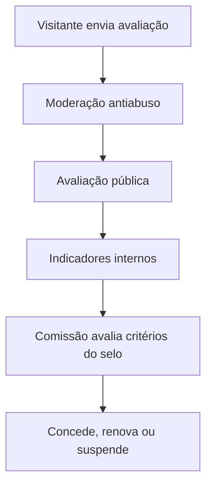
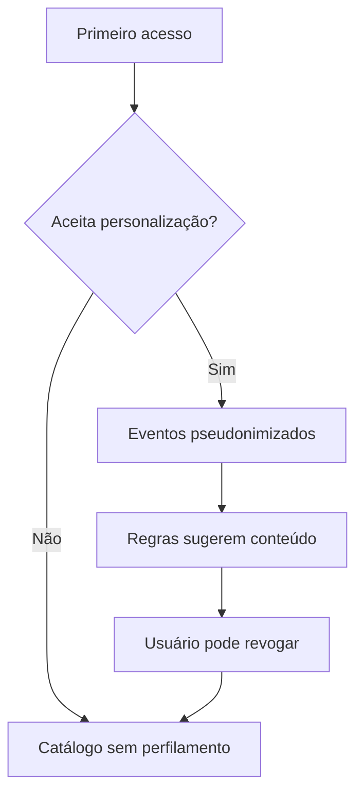

# User flows do MVP

## UF-01 — Descobrir o território

Exceções: nenhum resultado oferece filtros alternativos; conteúdo sem tradução usa fallback identificado; preço ou disponibilidade ausente não bloqueia publicação.

## UF-02 — Montar Meu Caminho

O preço é estimado e a disponibilidade é confirmada pela equipe. A jornada não exige conta; contato só é obrigatório quando ela vira lead.

## UF-03 — Solicitar pacote pronto

## UF-04 — Cadastrar parceiro

## UF-05 — Parceiro atualizar perfil

## UF-06 — Operar lead

Estados: `new`, `qualified`, `planning`, `proposal_sent`, `accepted`, `completed`, `lost`, `cancelled`. Mudanças críticas guardam ator, data e motivo.

## UF-07 — Avaliar e conceder selo

Avaliação pública, ranking interno, promoção paga e Selo Caminhos são quatro mecanismos independentes.

## UF-08 — Consentimento e personalização

