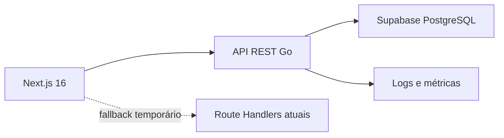
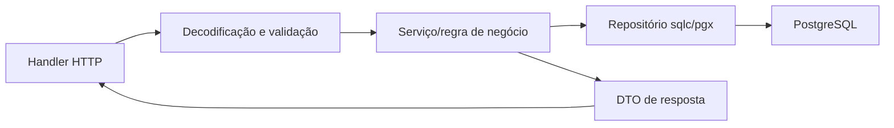

# Arquitetura obrigatória do Backend MVP

## 1. Decisão arquitetural

O backend será um **monólito modular em Go** implantado como um único serviço. Os módulos ficam separados por domínio no código, mas compartilham processo, configuração e banco.



Não criar microsserviços. O produto ainda não possui volume, equipe ou limites de domínio que justifiquem rede, filas, observabilidade distribuída e múltiplos deploys.

## 2. Stack e motivo de cada escolha

| Tecnologia | Decisão | Por que foi escolhida | O que não usar sem aprovação |
|---|---|---|---|
| Go | Go 1.26, fixado em `go.mod` e imagem do Docker | versão estável atual; tipagem, binário simples, boa concorrência e baixo custo operacional | versão diferente entre local/CI/Docker |
| HTTP | `net/http` + `github.com/go-chi/chi/v5` | `chi` é pequeno, compatível com `http.Handler`, modular e não impõe um framework inteiro | Gin, Fiber, Echo ou framework proprietário |
| PostgreSQL | `github.com/jackc/pgx/v5` + `pgxpool` | driver nativo para PostgreSQL, pool concorrente e acesso previsível a recursos do banco | `lib/pq`, cliente REST do Supabase como repositório principal |
| Queries | `sqlc` com SQL explícito | gera código Go tipado a partir de SQL real; evita reflexão e “mágica” de ORM | GORM, Ent ou auto-migration |
| Schema | SQL em `supabase/migrations/` | já é a fonte de verdade do repositório e do banco existente | segunda pasta de migrations divergente |
| Contrato | OpenAPI 3.1 em `services/api/docs/openapi.yaml` | contrato consumível por frontend, testes e documentação | contrato descrito apenas em README ou comentário |
| Logs | `log/slog` | biblioteca padrão, JSON estruturado e menos dependências | `fmt.Println` em fluxo operacional |
| Testes | `testing`, `httptest`, PostgreSQL descartável | ferramentas idiomáticas e teste contra comportamento real do banco | mocks como única evidência do repositório |
| Build | Docker multi-stage | artefato reproduzível e independente do provedor final | configuração específica de um provedor dentro do domínio |

Referências das decisões:

- [Histórico oficial de versões do Go](https://go.dev/doc/devel/release)
- [Documentação do chi v5](https://pkg.go.dev/github.com/go-chi/chi/v5)
- [Documentação do pgx v5](https://pkg.go.dev/github.com/jackc/pgx/v5)
- [sqlc com pgx/v5](https://docs.sqlc.dev/en/latest/guides/using-go-and-pgx.html)
- [Conexões PostgreSQL no Supabase](https://supabase.com/docs/guides/database/connecting-to-postgres)

## 3. Regra de conexão com Supabase

O serviço Go é persistente. Preferir conexão direta ou pooler em modo de sessão. O pooler em modo de transação não suporta prepared statements; se for obrigatório usá-lo, a configuração do pgx deve desabilitar prepared statements e essa decisão precisa estar documentada.

Variável principal:

```text
DATABASE_URL=postgres://<app-role>:<secret>@<host>:<port>/<database>?sslmode=require
```

Não usar `SUPABASE_SERVICE_ROLE_KEY` como credencial de banco no Go. Ela é uma chave privilegiada do ecossistema de APIs Supabase. A API Go deve usar uma credencial PostgreSQL própria, com o menor conjunto de grants necessário.

Requisitos do pool:

- `MaxConns` configurável e baixo no free tier;
- `MinConns` igual a zero ou um;
- tempo máximo de aquisição;
- `Ping` no readiness, não em toda requisição;
- timeout por query via `context.Context`;
- fechamento no graceful shutdown.

## 4. Estrutura de pacotes

```text
services/api/
├── cmd/api/main.go
├── internal/
│   ├── platform/
│   │   ├── config/
│   │   ├── httpx/
│   │   ├── logging/
│   │   └── postgres/
│   ├── catalog/
│   │   ├── handler.go
│   │   ├── service.go
│   │   └── repository.go
│   ├── recommendation/
│   ├── intake/
│   └── planning/
├── db/
│   ├── query/
│   └── generated/
├── docs/openapi.yaml
├── testdata/
├── Dockerfile
├── Makefile
├── go.mod
├── go.sum
└── sqlc.yaml
```

### Responsabilidade dos módulos

| Módulo | Responsabilidade |
|---|---|
| `catalog` | categorias, localidades, lugares, negócios/hospedagens, experiências e mapa |
| `recommendation` | regras determinísticas do quiz e motivos da recomendação |
| `intake` | Cadastro Único e compatibilidade temporária de demandas |
| `planning` | solicitação de planejamento formada pela seleção do visitante |
| `platform/httpx` | JSON, erros, request ID, limites, CORS e middleware |
| `platform/postgres` | pool, transações e health/readiness |

Não criar uma interface para cada struct “porque clean architecture manda”. Uma interface só existe quando há mais de uma implementação real ou quando o teste precisa de uma fronteira estável. O objetivo é baixo acoplamento, não cerimônia.

## 5. Fluxo interno de uma requisição



- Handler conhece HTTP, não SQL.
- Serviço conhece regra de negócio, não detalhes de roteamento.
- Repositório executa query, não decide status HTTP.
- DTO público não expõe modelo de banco automaticamente.
- Erros de domínio são convertidos por um único mapper HTTP.

## 6. Versionamento e rotas

Todas as capacidades de produto começam em `/v1`. Healthchecks ficam fora da versão.

```text
GET  /health/live
GET  /health/ready
GET  /v1/...
POST /v1/...
```

Mudança incompatível exige nova versão ou período de compatibilidade. Renomear JSON, remover enum ou mudar semântica não pode ser feito apenas porque o frontend e backend estão no mesmo repositório.

## 7. Integração com Next.js durante a refatoração

O frontend não muda tudo de uma vez. A ordem é:

1. implementar a API;
2. criar cliente HTTP tipado no Next.js;
3. manter Route Handlers atuais como adaptadores/fallback;
4. migrar leitura por página;
5. migrar escritas;
6. observar erros e protocolos;
7. remover acesso direto ao Supabase apenas após estabilização.

Durante a transição, preferir chamadas server-to-server do Next.js para a API. Se o navegador chamar a API diretamente, usar allowlist de origem e `credentials` apenas onde cookie for realmente necessário.

## 8. Cookies e sessão anônima

Cookie não é autenticação. O Backend MVP pode emitir um identificador anônimo para correlação operacional, mas ele não concede permissão administrativa.

Configuração mínima do cookie quando usado:

```text
Name: caminhos_visitor
HttpOnly: true
Secure: true em produção
SameSite: Lax
Path: /
Max-Age: configurável
```

O valor enviado ao navegador deve ser opaco e aleatório. No banco, armazenar hash quando houver necessidade de recuperar sessão. Neste MVP, o rascunho de “Meu Caminho” permanece no cliente; a API usa o cookie apenas como identificador opcional ao receber a solicitação.

## 9. Configuração

Variáveis obrigatórias no startup:

| Variável | Uso |
|---|---|
| `APP_ENV` | `local`, `test`, `staging` ou `production` |
| `HTTP_ADDR` | endereço do servidor, exemplo `:8080` |
| `DATABASE_URL` | conexão PostgreSQL da aplicação |
| `WEB_ALLOWED_ORIGINS` | allowlist separada por vírgulas |
| `REQUEST_TIMEOUT` | timeout máximo da requisição |
| `SHUTDOWN_TIMEOUT` | prazo do graceful shutdown |
| `MAX_REQUEST_BODY_BYTES` | limite global de corpo |
| `RATE_LIMIT_PER_MINUTE` | limite inicial por chave/IP confiável |
| `DEFAULT_LOCALE` | `pt-BR` |

O serviço deve falhar no startup com mensagem clara quando falta configuração obrigatória. Nunca imprimir o valor de segredo.

## 10. Observabilidade mínima

Cada requisição registra:

- timestamp;
- nível;
- ambiente;
- request ID;
- método;
- rota normalizada;
- status;
- duração;
- tamanho da resposta;
- classe de erro.

Não registrar:

- corpo integral;
- e-mail, telefone, nome ou relato;
- valor do cookie;
- `DATABASE_URL`;
- stack trace em resposta pública.

## 11. Segurança mínima

- body limitado antes de decodificar JSON;
- `DisallowUnknownFields` nos comandos de escrita, exceto `details` tipado do Cadastro Único;
- uma única entidade JSON por request;
- validação de enum, tamanho, formato e relação;
- queries geradas/parametrizadas;
- CORS por allowlist;
- rate limit nas escritas;
- idempotência em submissões sensíveis;
- timeouts HTTP e banco;
- cabeçalhos seguros no gateway/serviço;
- PII redigida nos logs;
- mensagens de erro públicas sem detalhes internos.

## 12. Decisões explicitamente adiadas

- provedor de deploy da API;
- autenticação administrativa;
- armazenamento de mídia;
- cache externo;
- filas e notificações;
- PostGIS. Para o recorte inicial, latitude/longitude e filtro por bounding box são suficientes;
- tracing distribuído. Métricas e logs estruturados bastam para um único serviço.
