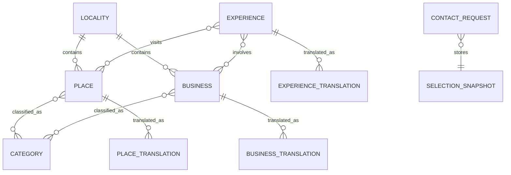

# Domínio e banco de dados

## 1. Fonte observada no código atual

O Backend MVP parte das estruturas existentes, não de um marketplace imaginário.

| Fonte atual | Conteúdo | Destino no backend |
|---|---|---|
| `lib/data.ts::CATEGORIAS` | cinco categorias de mapa | `categories` |
| `lib/data.ts::PONTOS` | oito pontos territoriais misturando lugares e negócios | `places` ou `businesses` após classificação |
| `lib/data.ts::EXPERIENCIAS` | quatro experiências com relações e regras | `experiences` + tabelas relacionais |
| `lib/data.ts::HOSPEDAGENS` | três hospedagens | `businesses` com `kind=lodging` |
| `lib/recommend.ts` | pontuação determinística | módulo `recommendation`, sem tabela própria |
| `app/api/submissions/route.ts` | Cadastro Único | tabela existente `submissions` |
| `app/api/demands/route.ts` | demandas do Observatório | tabela existente `demands` |
| seleção futura do visitante | “Meu Caminho” montado no frontend | `contact_requests` com snapshot da seleção |

## 2. Correções de modelagem obrigatórias

### 2.1 Lugar, negócio e experiência não são a mesma entidade

- **Lugar** é uma referência territorial: praia, trilha, patrimônio, ruína, ponto de apoio ou outro espaço.
- **Negócio** é uma organização/iniciativa que oferece algo: hospedagem, gastronomia, comércio, guia ou serviço.
- **Experiência** é uma composição editorial ou comercial de lugares e negócios, com duração, formato, sequência e cuidados.

O código atual mistura essas responsabilidades dentro de `PONTOS`. A importação precisa classificar cada registro. Não copiar tudo para uma tabela genérica sem discutir a semântica.

### 2.2 Publicação e validação são estados diferentes

```text
publication_status: draft | published | archived
verification_status: unverified | in_review | verified
```

Um item pode estar publicado com aviso de “em validação”, mas conteúdo demonstrativo com contato fictício deve ficar somente em local/teste. A API nunca converte `demonstrativo` em `verified`.

### 2.3 Preço atual não é preço comercial

Os campos `custo` e `faixa` são textos. O banco do MVP preserva isso em `price_note`/`price_range_label`. Não criar `amount_cents`, moeda, promoção ou disponibilidade até existir regra operacional de preço.

## 3. Modelo relacional mínimo

### 3.1 `localities`

| Coluna | Tipo | Regra |
|---|---|---|
| `id` | `uuid` | PK, `gen_random_uuid()` |
| `slug` | `text` | único, estável |
| `name` | `text` | nome em PT-BR |
| `municipality` | `text` | exemplo `Angra dos Reis` |
| `state_code` | `char(2)` | `RJ` inicialmente |
| `created_at`/`updated_at` | `timestamptz` | obrigatórios |

Não usar texto livre como única relação de localidade nos novos conteúdos. O formulário público ainda pode enviar texto e ser normalizado posteriormente.

### 3.2 `categories`

| Coluna | Tipo | Regra |
|---|---|---|
| `id` | `uuid` | PK |
| `code` | `text` | único: `eat`, `stay`, `visit`, `do`, `services` |
| `color_hex` | `text` | formato `#RRGGBB` |
| `sort_order` | `smallint` | ordenação editorial |
| `active` | `boolean` | padrão `true` |

### 3.3 `category_translations`

| Coluna | Tipo | Regra |
|---|---|---|
| `category_id` | `uuid` | FK |
| `locale` | `text` | `pt-BR`, `en`, `es` ou `de` |
| `label` | `text` | obrigatório |
| `description` | `text` | obrigatório |

PK composta: `(category_id, locale)`.

### 3.4 `places`

| Grupo | Colunas principais |
|---|---|
| Identidade | `id uuid`, `slug text unique`, `locality_id uuid` |
| Geografia | `latitude numeric(9,6)`, `longitude numeric(9,6)`, `coordinate_precision text` |
| Operação | `opening_hours_note`, `accessibility_note`, `access_note`, `care_note` |
| Confiança | `publication_status`, `verification_status`, `source_url`, `source_checked_at` |
| Auditoria | `created_at`, `updated_at`, `published_at` |

`coordinate_precision`: `exact`, `approximate` ou `protected`. Itens sensíveis/protegidos não retornam coordenada exata.

### 3.5 `place_translations`

`place_id`, `locale`, `name`, `summary`, `description`. PK composta por entidade e locale.

### 3.6 `place_categories`

Relação N:N entre lugar e categoria. PK `(place_id, category_id)`.

### 3.7 `businesses`

| Grupo | Colunas principais |
|---|---|
| Identidade | `id uuid`, `slug text unique`, `kind text`, `locality_id uuid` |
| Mapa | `latitude`, `longitude`, `coordinate_precision` opcionais |
| Contato público | `phone`, `whatsapp_url`, `instagram_url`, `website_url` |
| Operação | `opening_hours_note`, `accessibility_note`, `price_range_label` |
| Confiança | `publication_status`, `verification_status`, `source_url`, `source_checked_at` |
| Auditoria | `created_at`, `updated_at`, `published_at` |

`kind` inicial: `lodging`, `food`, `shop`, `service`, `guide`, `producer`, `artisan`, `community_initiative`, `other`.

Não armazenar telefone fictício em seed de produção.

### 3.8 `business_translations` e `business_categories`

Mesmo padrão de tradução e classificação dos lugares.

### 3.9 `experiences`

| Grupo | Colunas principais |
|---|---|
| Identidade | `id uuid`, `slug text unique` |
| Classificação | `duration text`, `format text` |
| Apresentação | `cover_image_url text`, `price_note text` |
| Operação | `transport_note`, `care_note`, `accessibility_note` |
| Confiança | `publication_status`, `verification_status`, `source_url`, `source_checked_at` |
| Auditoria | `created_at`, `updated_at`, `published_at` |

Enums de domínio:

```text
duration: short | half_day | full_day
format: self_guided | guided
```

### 3.10 `experience_translations`

`experience_id`, `locale`, `name`, `summary`, `why`. PK composta.

### 3.11 Relações da experiência

- `experience_steps(experience_id, position, locale, description)`;
- `experience_places(experience_id, place_id, position)`;
- `experience_businesses(experience_id, business_id, position)`;
- `experience_interests(experience_id, interest_code)`;
- `experience_audiences(experience_id, audience_code)`.

Interesses iniciais preservam o código atual:

```text
nature, history, gastronomy, culture, memory,
beaches, communities, local_production, rest, education
```

Públicos iniciais:

```text
solo, couple, family, group
```

## 4. Conteúdo multilíngue

Locales suportados pelo contrato: `pt-BR`, `en`, `es`, `de`.

Regras:

1. PT-BR é obrigatório para publicar.
2. Os demais são opcionais no Backend MVP.
3. Quando não existe tradução, a API retorna PT-BR e informa `resolvedLocale`.
4. O backend não traduz automaticamente.
5. Slug permanece único e estável entre idiomas nesta fase.
6. Texto de interface continua no Next.js/`next-intl`; texto de conteúdo vive no banco.

## 5. Tabelas existentes: preservação obrigatória

### 5.1 `submissions`

A migration `20260801000000_create_intake_tables.sql` já pode estar aplicada em produção. Ela não deve ser alterada.

Estados atuais:

```text
pending | reviewing | approved | rejected | archived
```

Tipos aceitos pelo formulário atual:

```text
hospedagem
empreendimento
experiencia
atrativo
mapeamento
selo
formacao
voluntario
parceiro
apoio
sugestao
```

O campo `details jsonb` permanece, mas a API valida os campos obrigatórios de acordo com `type`.

| Tipo | Campos de `details` obrigatórios |
|---|---|
| `hospedagem` | `nome_hospedagem`, `tipo_hospedagem`, `endereco` |
| `empreendimento` | `nome_empreendimento`, `categoria`, `descricao` |
| `experiencia` | `nome_experiencia`, `lugares`, `descricao` |
| `atrativo` | `nome_atrativo`, `tipo`, `localizacao`, `descricao` |
| `mapeamento` | `categoria`, `nome`, `onde_fica`, `importancia` |
| `selo` | `iniciativa`, `categoria`, `motivo` |
| `formacao` | `temas` |
| `voluntario` | `contribuicao` |
| `parceiro` | `instituicao`, `proposta` |
| `apoio` | `tipo_apoio`, `descricao` |
| `sugestao` | `assunto`, `sugestao` |

Uma nova migration pode adicionar:

- trigger real de `updated_at`;
- `idempotency_key_hash` opcional/único;
- índices necessários;
- constraints de tamanho quando seguras para dados existentes.

### 5.2 `demands`

Estados atuais:

```text
received | reviewing | forwarded | answered | archived
```

A API Go preserva a escrita enquanto `/demandas` continuar no Next.js. Não ampliar o domínio do Observatório dentro deste MVP.

## 6. `contact_requests`

Representa uma solicitação de planejamento, nunca uma reserva.

| Coluna | Tipo | Regra |
|---|---|---|
| `id` | `uuid` | PK |
| `protocol` | `text` | único e não sequencial, prefixo `PLAN` |
| `visitor_id_hash` | `text` | opcional; nunca salvar cookie puro |
| `name` | `text` | obrigatório |
| `email` | `text` | nullable |
| `phone` | `text` | nullable |
| `preferred_channel` | `text` | `email`, `whatsapp` ou `phone` |
| `locale` | `text` | locale da solicitação |
| `selection_snapshot` | `jsonb` | itens validados e texto exibido no envio |
| `preferences` | `jsonb` | datas, grupo, orçamento e observações opcionais |
| `status` | `text` | `received`, `in_review`, `contacted`, `closed`, `cancelled` |
| `consented_at` | `timestamptz` | obrigatório |
| `created_at`/`updated_at` | `timestamptz` | obrigatórios |
| `idempotency_key_hash` | `text` | único por janela/escopo |

Exigir ao menos e-mail ou telefone. O snapshot deve conter, por item:

```json
{
  "kind": "experience",
  "id": "uuid",
  "slug": "memoria-e-sabores",
  "name": "Memória e Sabores de Mambucaba",
  "verificationStatus": "verified",
  "priceNote": "Sob consulta"
}
```

Não aceitar nome/preço enviado pelo frontend como verdade. O frontend envia apenas `kind` + `id`; a API busca os registros publicados e monta o snapshot.

## 7. Relações principais



## 8. Plano de importação dos dados atuais

1. Criar script de importação idempotente, não copiar manualmente via migration de produção.
2. Converter códigos PT do frontend para códigos estáveis em inglês no banco.
3. Classificar cada `PONTO` como lugar ou negócio.
4. Resolver duplicidade da “Pousada Serra & Mar”, presente em `PONTOS` e `HOSPEDAGENS`.
5. Converter relações `EXPERIENCIAS.pontos` de `p1...p8` para UUIDs reais.
6. Preservar apenas PT-BR inicialmente.
7. Marcar conteúdo demonstrativo como `draft/unverified`.
8. Inserir contatos fictícios apenas em seed local/teste.
9. Gerar relatório de itens importados, ignorados e conflitantes.
10. Executar dry-run antes de qualquer escrita em staging/produção.

## 9. Seed por ambiente

| Ambiente | Conteúdo permitido |
|---|---|
| `local` | dataset demonstrativo atual, com aviso explícito |
| `test` | fixtures mínimas determinísticas |
| `staging` | conteúdo aprovado para homologação, sem PII real desnecessária |
| `production` | somente conteúdo validado/importado pela operação |

Migration cria schema. Seed cria dados de ambiente. Não misturar as duas responsabilidades.

## 10. Índices mínimos

- `places(publication_status, updated_at desc)`;
- `places(locality_id)`;
- `businesses(kind, publication_status, updated_at desc)`;
- `businesses(locality_id)`;
- `experiences(publication_status, updated_at desc)`;
- índices únicos de slug;
- índices compostos de tradução `(entity_id, locale)`;
- índices das tabelas de relação nos dois sentidos;
- `submissions(status, created_at desc)` já existente;
- `demands(status, created_at desc)` já existente;
- `contact_requests(status, created_at desc)`;
- `contact_requests(protocol)` único;
- `contact_requests(idempotency_key_hash)` único quando não nulo.

## 11. Regras de migration

- nunca editar migration aplicada;
- uma responsabilidade por migration quando possível;
- mudança destrutiva exige estratégia expand/contract;
- adicionar coluna nullable ou com default seguro antes de torná-la obrigatória;
- testar upgrade sobre o schema atual, não apenas banco vazio;
- produção não executa migration automaticamente no startup da API;
- rollback é preferencialmente uma nova migration corretiva; não assumir que `down` destrutivo será seguro.
