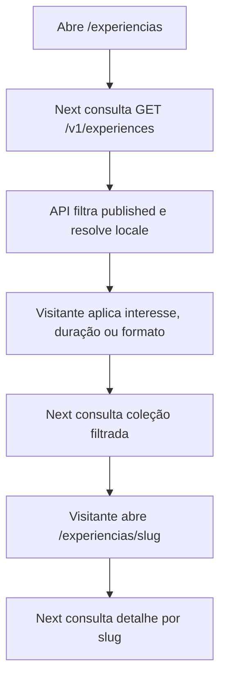
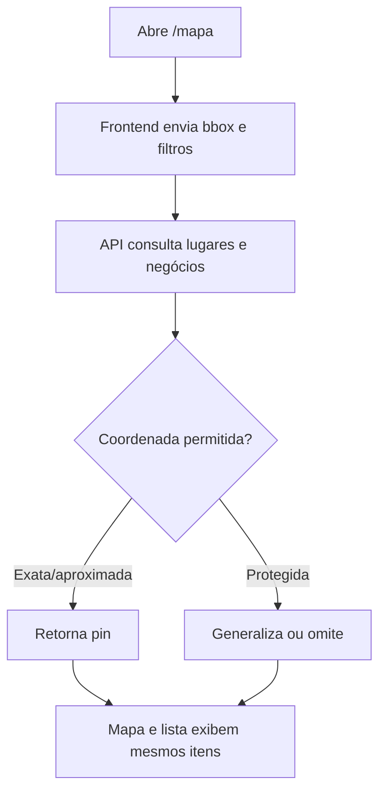
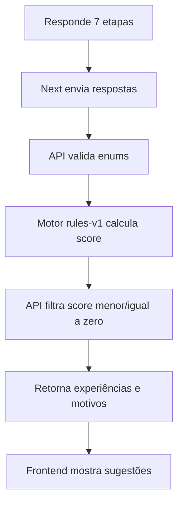
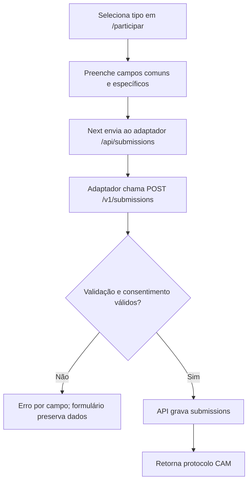
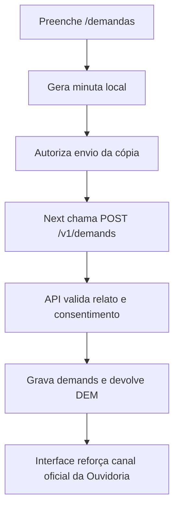
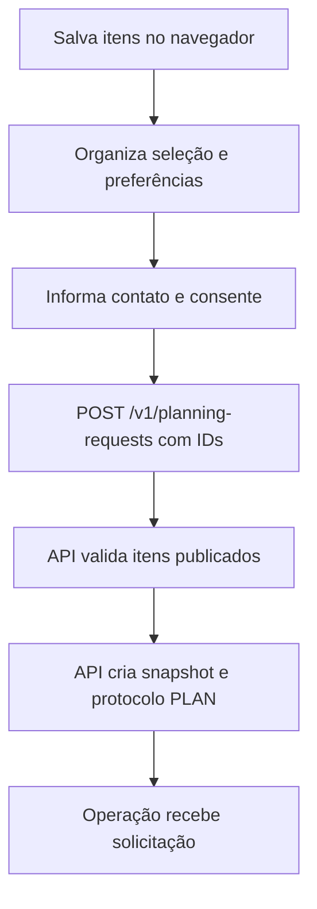
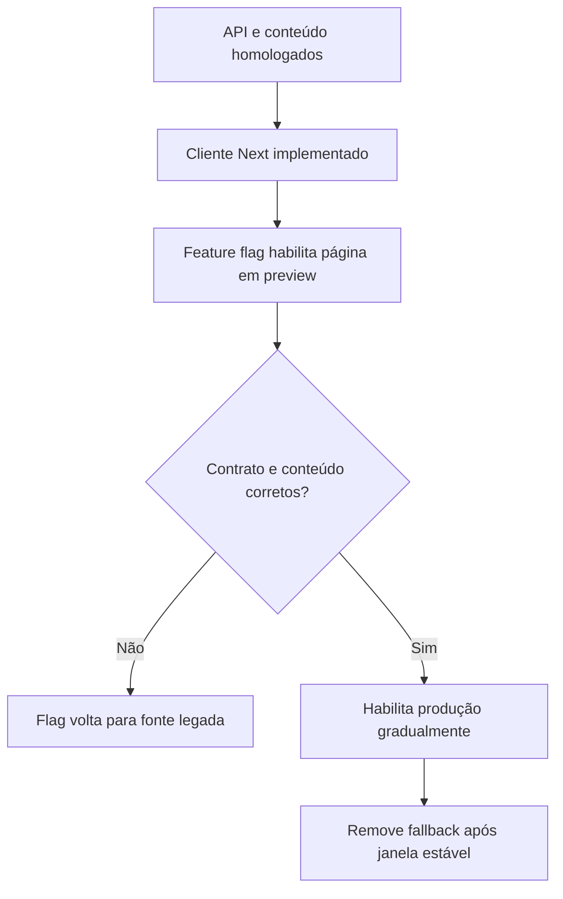
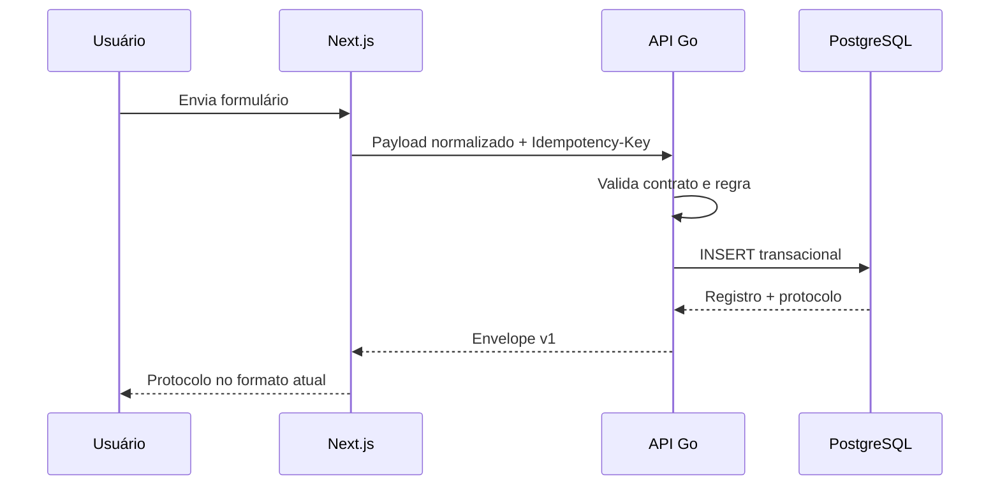
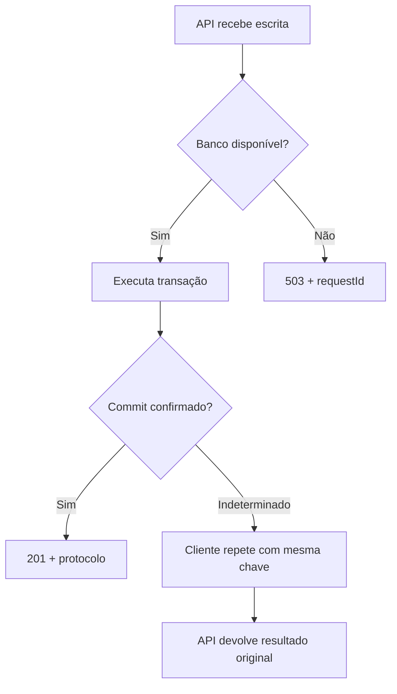

# User flows e fluxos de dados

## 1. Visitante explora experiências

**Ator:** visitante
**Resultado:** encontra conteúdo publicado e abre detalhe indexável no Next.js.

Exceções:

- catálogo vazio deve retornar `200` + `data: []`, não `404`;
- slug inexistente ou não publicado retorna `404`;
- tradução ausente retorna PT-BR com fallback declarado;
- conteúdo `draft` nunca aparece mesmo que o ID/slug seja conhecido.

## 2. Visitante explora o mapa

**Ator:** visitante
**Resultado:** visualiza lugares e negócios publicáveis sem expor coordenadas sensíveis.

Regras:

- lista e mapa vêm do mesmo endpoint para não divergir;
- negócio sem coordenada pode aparecer no catálogo, mas não no mapa;
- contato só aparece quando público e validado para publicação;
- filtro de texto continua cobrindo nome, localidade e resumo.

## 3. Visitante recebe recomendação pelo quiz

**Ator:** visitante
**Resultado:** recebe experiências ordenadas por regras transparentes.

O motor não é IA. `profile`, `hasCar` e `spendProfile` ainda não alteram score. Isso deve permanecer visível na documentação e nos testes até o PO aprovar outra regra.

## 4. Pessoa envia Cadastro Único

**Ator:** morador, empreendedor, organização, visitante ou colaborador
**Resultado:** contribuição privada armazenada com protocolo.

Regras:

- o frontend não define o protocolo;
- `details` é validado conforme o tipo;
- repetição por timeout com a mesma chave não duplica registro;
- protocolo não permite consulta pública de PII neste MVP;
- sucesso não significa aprovação/publicação.

## 5. Pessoa registra demanda enquanto o fluxo existir

**Ator:** cidadão
**Resultado:** cópia privada registrada no Observatório com protocolo próprio.

Este fluxo é compatibilidade do produto publicado. Ele não autoriza trazer todo o domínio do Observatório para o Backend MVP do Caminhos.

## 6. Visitante monta “Meu Caminho” e solicita planejamento

**Ator:** visitante anônimo
**Resultado:** seleção local vira solicitação de atendimento, sem falsa reserva.

Exceções:

- item removido ou despublicado antes do envio: retornar erro por item para o usuário ajustar;
- contato ausente: `400`;
- canal preferido sem dado correspondente: `422`;
- mesma chave/payload: retornar protocolo anterior;
- mesma chave/payload diferente: `409`;
- nenhuma resposta pode usar “reserva confirmada”.

## 7. Migração de leitura sem interromper o site

**Ator:** equipe técnica
**Resultado:** página muda da fonte estática para a API com rollback controlado.

Critérios antes de remover fallback:

- mesmas capacidades visíveis ou decisão explícita de mudança;
- nenhum conteúdo fictício promovido;
- logs sem aumento anormal de `4xx/5xx`;
- SEO e renderização do Next continuam funcionando;
- rotas públicas críticas testadas em produção.

## 8. Migração das escritas do Next para Go

Enquanto o adaptador existir, o navegador continua chamando `/api/submissions` e `/api/demands`. Isso evita CORS, permite rollback e reduz o tamanho da primeira alteração do frontend.

## 9. Falha de dependência

Esse é o motivo de idempotência ser requisito e não acabamento.

## 10. Handoff para o frontend

O backend entrega ao frontend:

- URL de ambiente;
- OpenAPI atualizado;
- exemplos `.http`/collection;
- matriz endpoint → página/componente atual;
- enum legado → enum API;
- tratamento esperado de vazio/erro/fallback;
- instruções para `Idempotency-Key`;
- dados de seed local sem PII;
- lista de limitações.

Mapeamento mínimo:

| Frontend atual | Contrato Go |
|---|---|
| `lib/data.ts::CATEGORIAS` | `GET /v1/catalog/metadata` |
| `lib/data.ts::PONTOS` | `GET /v1/map-points` + detalhes de lugar/negócio |
| `lib/data.ts::EXPERIENCIAS` | `GET /v1/experiences` e `/{slug}` |
| `lib/data.ts::HOSPEDAGENS` | `GET /v1/businesses?kind=lodging` |
| `lib/recommend.ts::recomendar` | `POST /v1/recommendations/experiences` |
| `/api/submissions` | adaptador para `POST /v1/submissions` |
| `/api/demands` | adaptador para `POST /v1/demands` |
| botão futuro de solicitar plano | `POST /v1/planning-requests` |
